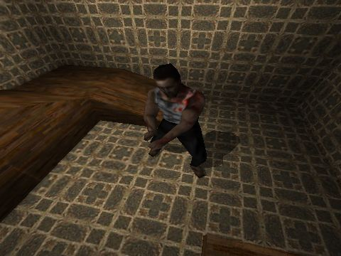



## Actor MD2 sample with dynamic shadows

### Description

This code demonstrates one of the iRender 3D game engine features - md2 loading, rendering with dynamic lighting and shadows.

There are only 50 lines of code. This sample uses iRender3D.dll which you can download from http://irender3d.com in download section (It is about 250 kb).
 
### More Info
 

             |
---                |---
**Submitted On**   |2005-02-05 11:47:58
**By**             |[iR\_OrBit](https://github.com/Planet-Source-Code/PSCIndex/blob/master/ByAuthor/ir-orbit.md)
**Level**          |Advanced
**User Rating**    |5.0 (20 globes from 4 users)
**Compatibility**  |VB 6\.0
**Category**       |[DirectX](https://github.com/Planet-Source-Code/PSCIndex/blob/master/ByCategory/directx__1-44.md)
**World**          |[Visual Basic](https://github.com/Planet-Source-Code/PSCIndex/blob/master/ByWorld/visual-basic.md)
**Archive File**   |[Actor\_MD2\_184866252005\.zip](https://github.com/Planet-Source-Code/ir-orbit-actor-md2-sample-with-dynamic-shadows__1-58710/archive/master.zip)

